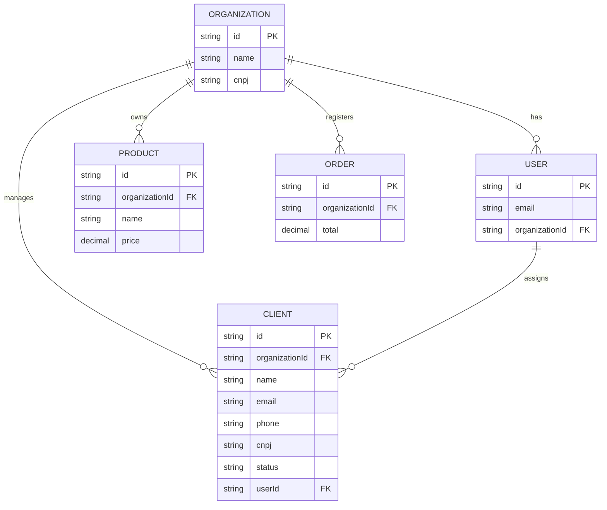

# Dashboard de Gestão Financeira B2B

Plataforma corporativa de gestão para empresas de pequeno e médio porte. O sistema centraliza o controle de pedidos, produtos e clientes, permitindo gestão autônoma ou colaboração com consultores especializados, garantindo isolamento total de dados e segurança corporativa.

---

# Arquitetura e Modelagem

O sistema adota uma arquitetura _Multi-tenancy_ (isolamento por locatário), onde cada empresa (Organização) possui seu próprio escopo de dados.

### Diagrama de Entidade-Relacionamento (Mermaid)

# Decisões Técnicas (ADR)

Segurança: Implementação de autenticação via JWT armazenado em Cookies HTTP-only (SameSite=Strict), mitigando ataques XSS.

**Isolamento B2B:** Uso obrigatório de organizationId em todas as tabelas e queries (where: { organizationId: ... }), garantindo que dados de diferentes empresas jamais sejam cruzados.

**Performance:** Validação de acesso realizada via Middleware (Edge) do Next.js, garantindo latência mínima ao interceptar rotas privadas.

**Integridade:** Senhas protegidas via Bcrypt (custo 10) e uso de Soft Delete (deletedAt) para preservação de histórico e auditoria conforme as Regras de Negócio estabelecidas.

# Pilares do Sistema

**Gestão Colaborativa:** Conexão segura entre empresas e consultores/gestores externos.

**Segurança de Dados:** Arquitetura pensada para conformidade e sigilo comercial entre diferentes locatários.

**Foco B2B:** Interface intuitiva com métricas financeiras focadas em desempenho e produtividade operacional.

# Tecnologias Principais

**Framework:** Next.js (App Router)

**ORM:** Prisma

**Banco de Dados:** PostgreSQL

**Segurança:** Bcrypt, Jose (JWT), Next.js Middleware

**UI:** Tailwind CSS, Radix UI (shadcn/ui)

# Roadmap de Desenvolvimento

[x] Configuração do Prisma (Modelagem do Schema corporativo).

[x] Auth Layer (Implementação de Login/Logout e Middleware de proteção).

**Nota:** O middleware.ts está temporariamente desativado em .bkp para permitir o roteamento fluido durante o desenvolvimento das telas.

[ ] Gestão de Dados (CRUDs de Clientes, Produtos e Pedidos com filtro por organizationId).

[x] Interface de Cadastro de Clientes (ClientForm).

[x] Segurança lógica e sanitização de dados (Zod + Regex).

[ ] Conexão da Server Action com o Prisma para persistência real no banco de dados.

[ ] Tela de Listagem e Datatable de Clientes.

[ ] Funcionalidades de Edição (Update) e Exclusão (Delete) de Clientes.

[ ] CRUD de Produtos.

[ ] CRUD de Pedidos.

[ ] Módulo Analítico (Dashboard de KPIs e Exportação de relatórios).

[ ] Módulo de Colaboração (Conexão e gestão de acessos entre Organização e Consultores).

Desenvolvido com foco em escalabilidade, segurança e excelência técnica.
