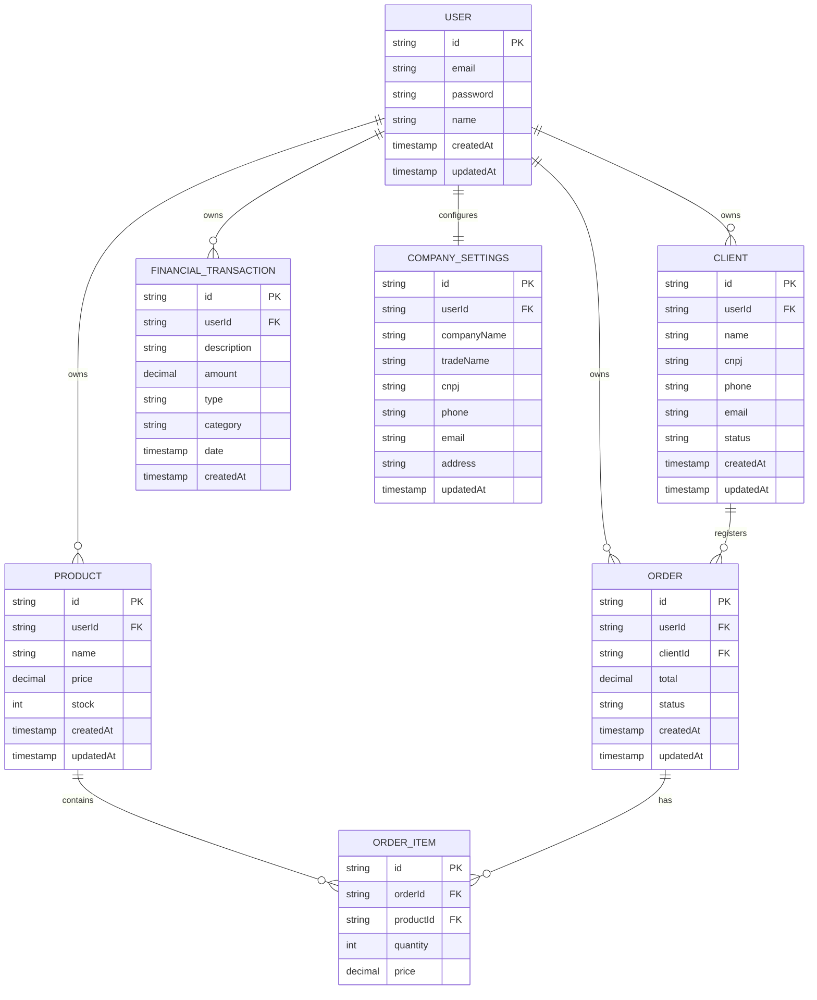

# ERP de Gestão Interna

Plataforma corporativa de gestão interna voltada para o controle operacional exclusivo da fábrica. O sistema centraliza o gerenciamento de estoque, catálogo de produtos, carteira de clientes corporativos, fluxo financeiro de caixa e o processo completo de faturamento de pedidos de venda, garantindo alta performance e centralização de dados.

---

# Arquitetura e Modelagem

O sistema adota uma arquitetura de **Gestão Interna Dedicada (Single-tenant)**, eliminando qualquer tipo de barreira multi-empresa ou isolamento dinâmico complexo por chaves organizacionais.

### Diagrama de Entidade-Relacionamento (Mermaid)

# Decisões Técnicas (ADR)

**Segurança:** Implementação de autenticação via JWT armazenado em Cookies HTTP-only (`SameSite=Strict`), mitigando de forma nativa ataques de injeção XSS.

**Simplificação ERP:** Eliminação total do campo `organizationId` e do isolamento multi-tenant. O sistema opera sob o escopo exclusivo de uma única empresa, tornando o código mais leve e rápido.

**Performance:** Validação de sessão e proteção de escopo privado executadas de forma centralizada via Middleware (Edge) do Next.js, garantindo latência mínima ao interceptar rotas restritas.

**Integridade Rígida:** Senhas protegidas via Bcrypt (fator de custo 10) e uso de deleção física em cascata (onDelete: Cascade) gerenciada pelo banco de dados para simplificar o ciclo de vida dos registros locais.

# Pilares do Sistema

**Eficiência Produtiva:** Centralização completa do catálogo de produtos e do estoque físico da fábrica.

**Fidelidade Financeira:** Armazenamento estático do preço praticado no ato da venda (`OrderItem.price`), impedindo que flutuações futuras do catálogo corrompam o histórico de faturamento da empresa.

**Foco Operacional:** Interface otimizada e limpa para emissão rápida de vendas e controle de expedição direto pela equipe interna.

# Tecnologias Principais

**Framework:** Next.js (App Router)

**ORM:** Prisma (Configuração adaptada para o padrão do Prisma 7 via prisma.config.ts)

**Banco de Dados:** PostgreSQL

**Segurança:** Bcrypt, Jose (JWT), Next.js Middleware

**UI:** Tailwind CSS, Radix UI (shadcn/ui), Lucide React

Desenvolvido com foco em escalabilidade, segurança e excelência técnica.
